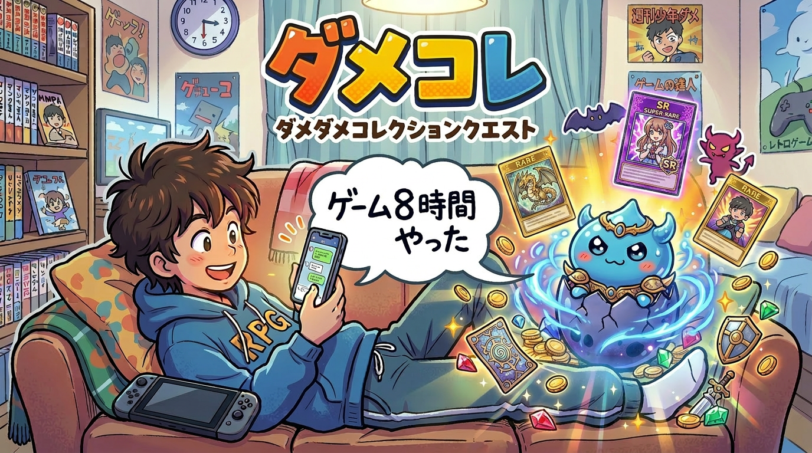

# 🐲 ダメコレ — ダメダメコレクションクエスト

> **ダメ行動を記録するたびにモンスターが生まれ、育ち、進化する。**
> コレクションしたくなって、もっとダメなことをしてしまう——それ自体が「人をダメにする」仕組み。
>
> でも、ダメを記録し続けた先には——自分のパターンが見えてくる。

## 概要

**「ダメ行動の記録」を「モンスター育成ゲーム」に変換し、ユーザーが自発的にダメになりたくなる中毒ループを生み出す。**

ダメ行動する → モンスターが育つ → もっとダメしたくなる → さらに育つ → …

## 背景

寝坊した、課金した、締切を破った——ダメ行動のたびに罪悪感が生まれ、自己嫌悪のループに陥る人は多い。でも本当は、ダメ行動は「人間らしさ」そのもの。

**ダメコレは、この「罪悪感」を「ご褒美」に反転させる。**

## 人をダメにするループ

コレクション欲・進化欲・発見欲・競争欲——すべてが「もっとダメしたい」に直結する。モンスターは進化し、分岐し、図鑑は埋まらない。**やればやるほどダメになる。やめられない。**

「締切明日なのにゲーム8時間やった」→ AI分析（属性：逃避 / 深刻度：★★★★）→ 「ゲームゴブリン」Lv.12→18 に成長！新技「あと1ステージだけ」習得！→ あと2回で変身可能！

## 逆説的価値

ダメを「記録する」「可視化する」「楽しむ」ことで、結果的に：

- 自分の行動パターンが丸見えになる（**自己認知**）
- 「またこのダメやってるな」と気づく（**メタ認知**）
- 図鑑が偏っていることに気づく（**弱点の可視化**）

**→ 「人をダメにする」サービスが、人を少しだけマシにしてしまう。**

## 技術構成

- **Strands Agents + Bedrock AgentCore** — エージェント基盤（Memory/Gateway/Runtime）
- **Amazon Nova 2 Lite / Claude Sonnet 4.6** — 属性分類・モンスター名・技生成
- **Vertex AI Gemini** — モンスター画像生成
- **Cognito / Lambda / DynamoDB / S3 / EventBridge** — インフラ
- **Quart + Jinja2** — Web フロントエンド

## チーム

**Samurai Engineers**

## ライセンス

MIT License
