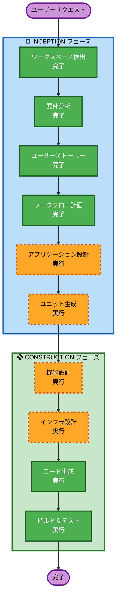

# 実行計画

## 分析サマリ

### 変更影響評価
- **ユーザー向け変更**: Yes — 全機能がユーザー直接操作
- **構造変更**: Yes — 新規アーキテクチャ（エージェント+Web+データストア）
- **データモデル変更**: Yes — モンスター、ユーザー、図鑑、進化ツリーのスキーマ設計が必要
- **API変更**: Yes — フロントエンド↔エージェント間のAPI設計が必要
- **NFR影響**: Yes — パフォーマンス（画像表示）、可用性（デモ安定性）

### リスク評価
- **リスクレベル**: Medium
- **理由**: 複数のAWSサービス連携（AgentCore + Bedrock + DynamoDB + S3）+ 外部API（Gemini）。ただしMVPスコープが明確で、ハッカソンプロトタイプのため本番運用リスクなし
- **ロールバック複雑度**: Low（新規プロジェクト）
- **テスト複雑度**: Moderate（AI応答の非決定性）

---

## フェーズ実行計画

### 🔵 INCEPTION フェーズ
- [x] ワークスペース検出 (完了)
- [x] 要件分析 (完了)
- [x] ユーザーストーリー (完了)
- [x] ワークフロー計画 (進行中)
- [ ] アプリケーション設計 - **実行**
  - **理由**: 新規コンポーネント多数（エージェント、Web、データストア）。コンポーネント間の責務分担とAPI設計が必要
- [ ] ユニット生成 - **実行**
  - **理由**: MVP 21ストーリーを実装可能な単位に分解する必要あり。エージェント/フロントエンド/データ層の並行開発を可能にする

### 🟢 CONSTRUCTION フェーズ（ユニットごと）
- [ ] 機能設計 - **実行**
  - **理由**: 進化ロジック、レア度判定、属性分析等の複雑なビジネスロジックの詳細設計が必要
- [ ] NFR要件 - **スキップ**
  - **理由**: 要件定義でNFRは既に定義済み。ハッカソンプロトタイプのため追加のNFR分析は不要
- [ ] NFR設計 - **スキップ**
  - **理由**: NFR要件をスキップするため
- [ ] インフラ設計 - **実行**
  - **理由**: AgentCore Runtime/Memory/Gateway + DynamoDB + S3 + Cognito のマッピングが必要
- [ ] コード生成 - **実行**（常に実行）
  - **理由**: 実装の計画と生成
- [ ] ビルド＆テスト - **実行**（常に実行）
  - **理由**: ビルド・テスト・検証

### 🟡 OPERATIONS フェーズ
- [ ] Operations - プレースホルダー（将来）

---

## ワークフロー可視化



### テキスト代替
```
INCEPTION フェーズ:
  ワークスペース検出 (完了) → 要件分析 (完了) → ユーザーストーリー (完了) → ワークフロー計画 (完了) → アプリケーション設計 (実行) → ユニット生成 (実行)

CONSTRUCTION フェーズ:
  機能設計 (実行) → インフラ設計 (実行) → コード生成 (実行) → ビルド＆テスト (実行)
```

---

## 成功基準
- **主目標**: 予選（5/30）で動作するMVPデモ
- **主要成果物**:
  - 動作するWebアプリ（チャット入力→モンスター生成→進化→図鑑）
  - ビジネスモード切り替え
  - 演出（孵化・進化・UR）
  - AWS上のインフラ構成
- **品質ゲート**:
  - チャット入力→モンスター表示が3秒以内
  - 進化・技解放の演出が正常動作
  - ビジネスモード切り替えが即座に動作
